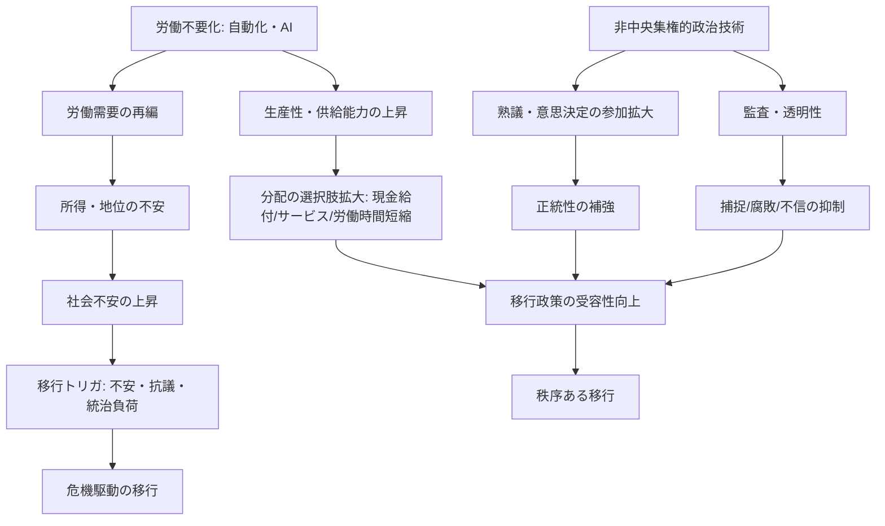
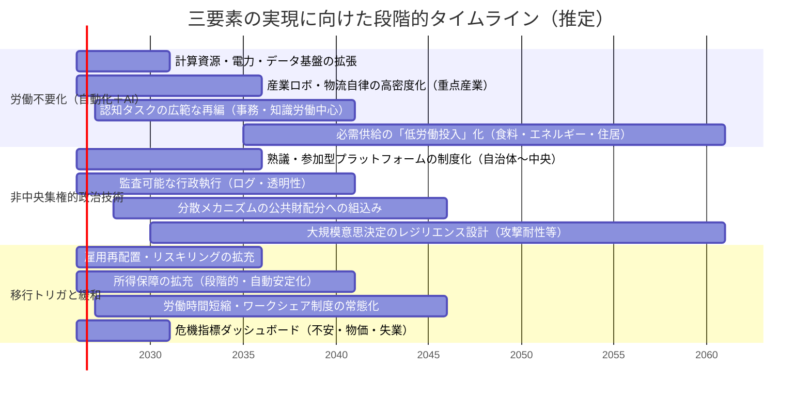
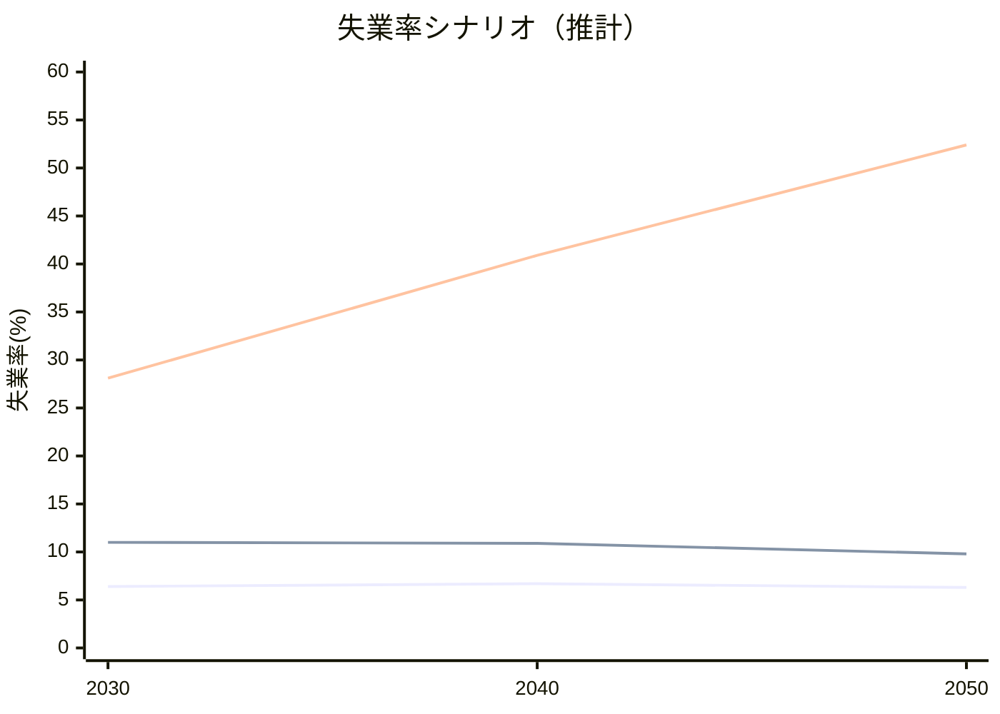

# 共産主義実現要素として提示された三要素の実現可能性と移行設計

## エグゼクティブサマリー

本報告書は、「共産主義実現要素」として提示された三要素――(1) 労働不要化（生産の圧倒的自動化とAI）、(2) 非中央集権的政治技術の発展、(3) 移行トリガ（AI失業率40％等の社会不安）――を、技術・経済・政治・社会の四側面から定義し、実現可能性、必要条件、移行設計（政策・制度）を、一次資料／国際機関／学術研究／公式ドキュメントに基づいて評価する。分析対象の「共産主義」は一枚岩の制度設計ではないため、本報告書では（古典的マルクス主義の「発展した共産主義社会」像が想定する）高い生産力に支えられた分配原理（「必要に応じた分配」等）と、そこへ至る移行問題（政治・ガバナンス・安全保障・社会統合）に焦点を当てる。citeturn22search1turn22search14  

第一に、AI・自動化が「労働不要化」をもたらす経路は、(a) 代替（displacement）と (b) 補完（complementarity）と (c) 新タスク創出（reinstatement）と (d) 需要（産出）拡大の相互作用で決まる。タスク・アプローチの標準的整理では、技術は労働需要を減らすだけでなく、条件次第で雇用・賃金を押し上げ得る。entity["people","ダロン・アセモグル","economist mit"]とentity["people","パスクアル・レストレポ","economist"]による整理は、まさに「自動化（タスクの資本化）による代替」と「新タスク創出」の競争として雇用影響を定式化している。citeturn16search8turn16search4  

第二に、近年の国際機関推計は「失業率40％」そのものよりも、「雇用（職務・タスク）のAI曝露（exposure）」や「職務再編」を強調する。entity["organization","国際通貨基金（IMF）","international financial org"]のスタッフ・ノートは、世界の雇用の「約40％がAIに曝露」し、先進国では「約60％が曝露」し得るとしつつ、曝露された職務の一部は補完で生産性・所得増につながり得る、と明示する。citeturn26view0turn13view0 さらにentity["organization","国際労働機関（ILO）","un labor agency"]のワーキングペーパーは、生成AI曝露を上限推計として評価し、「高曝露」が特に高いのは事務（clerical）であり、他の職群では高曝露タスク比率が小さいこと、影響の中心は「職業の完全自動化」より「職業内の一部タスク自動化（増補的影響）」になりやすいことを示す。citeturn26view1turn11view1  

第三に、企業調査ベースでは、entity["organization","世界経済フォーラム（WEF）","international ngo davos"]が「タスクの機械化は想定より緩やか」とし、2023時点で企業は「業務タスクの34％が機械、66％が人」と見積もり、2027年に「42％が自動化」と予測した。さらに、2023–2027で「構造的労働市場変動（churn）23％」を見込み、創出と消滅が併存する見立てを公表する。citeturn19view0 この種の見立ては「短期に社会の4割が失業」よりも、「職務再編＋再訓練＋所得補完＋労働時間調整」が現実的な政策課題であることを含意する。citeturn19view0turn33view0  

第四に、「非中央集権的政治技術」は既に複数の形で実装されているが、(a) 代表性・正統性、(b) セキュリティ、(c) スケール（参加者数・頻度・コスト）、(d) 資源（資金・時間・熟議能力）配分、(e) 法制度接続（執行・責任）にボトルネックがある。台湾のentity["organization","vTaiwan","taiwan civic consultation"]は「オンラインとオフラインを組み合わせた分散型の公開熟議プロセス」として制度は小さく始めて成果を出した一方、国家規模での恒常的・代表制代替には制度化課題が残る（後述）。citeturn3search7turn3search1 参加型プラットフォームとしてentity["organization","Decidim","participatory platform barcelona"]のようなOSS基盤も普及しているが、これも「意思決定の完全自動執行」ではなく、法制度・行政実務に接続するハイブリッド設計が前提になる。citeturn10view4  

第五に、「AI失業率40％」を移行トリガとする主張は、歴史比較では極めて高い閾値である。例えばentity["organization","米国労働省","us government dept"]の歴史整理では、1933年の米国失業は労働力の「約4分の1」に達したと推計される。citeturn7search0 40％級は戦争・封鎖等の極端ショックでは観測され得る（例：entity["place","ガザ地区","gaza strip"]で失業率が約80％に達したというILO報告）。citeturn15search3turn15search1 しかしAI単独で40％失業に至るには、「代替が補完・新タスクを大きく上回ること」「需要・資本循環が悪化すること」「政策が機能不全であること」など複合条件が必要で、国際機関・主要調査の中心見立て（曝露・再編）とは整合しにくい。citeturn26view0turn26view1turn19view0  

結論として、(1) 労働不要化は「一挙の全面失業」ではなく「必要労働の大幅縮小＋労働時間短縮＋所得・サービス保障」へと段階的に接続する設計が、既存エビデンスと整合的である。citeturn16search8turn35view0turn19view0 (2) 非中央集権政治技術は、ブロックチェーン単体よりも「熟議（collective intelligence）＋参加型制度＋安全なデジタルID＋監査可能な行政執行」を組み合わせる方がスケールしやすい。citeturn3search1turn10view1turn10view4 (3) トリガは「失業率」単独より、賃金停滞・生活費・格差・若年失業・政治的不信の複合で現れやすく、社会不安を予測する研究でも食料インフレ等のマクロ要因と既存不安が強い説明力を持つ。citeturn38view0turn8search2  

## 分析枠組みと三要素の定義

### 共産主義実現の操作的定義

本報告書の操作的定義では、「共産主義実現」を次の状態に近づく過程として扱う。  
生産力の高度化により、基礎的ニーズを満たすための社会的必要労働が大きく縮小し、分配が労働市場所得から相対的に切り離され、政治的には意思決定・資源配分の正統性が「市場・所有」に依存しにくい形で制度化されること。こうした像が古典テキストで強調する条件（生産力の全面的発展、協同組合的富の「すべての泉」からの豊富な湧出、必要に応じた分配）とも整合する。entity["people","カール・マルクス","philosopher economist"]の『ゴータ綱領批判』および関連研究の引用からも、「高次段階」は生産力発展と分業の克服を前提にすることが読み取れる。citeturn22search1turn22search14  

### 三要素の定義と主要構成要素

下表は、三要素を「技術・経済・政治・社会」の観点で分解し、何が「主要構成要素」かを明確化したものである（ユーザー提示の語を尊重しつつ、学術・政策で一般的な分解に合わせて再定義）。citeturn16search8turn26view0turn19view0  

| 要素 | 定義（本報告書） | 技術的構成 | 経済的構成 | 政治・制度的構成 | 社会的構成 |
|---|---|---|---|---|---|
| 労働不要化（自動化＋AI） | 「生活必需の供給」を維持しつつ、労働投入（労働時間・必要労働者数）を大幅に縮小する過程（完全失業とは同義でない） | 産業ロボット／自律移動・物流／生成AI・意思決定支援／ソフト自動化（RPA等）／計算資源・データセンター／電力・通信 citeturn26view2turn36view0turn27view5 | 生産性上昇と価格低下の「需要拡大効果」／資本所得・知財の帰属／労働需要の再編／再分配財源（税・配当・社会保険） citeturn26view0turn16search8turn16search2 | AIガバナンス（安全・透明・責任）／労使関係と移行支援／競争政策・データ政策／公共投資（計算資源等） citeturn14view0turn27view4turn14view1 | 受容性（「人間の関与が必要」という規範）／技能更新・再配置／生活保障への信頼／分配正統性 citeturn26view0turn32view3turn19view0 |
| 非中央集権的政治技術 | 合意形成・意思決定・執行・監査を、特定の官僚機構や中央権力に過度依存せずに成立させる制度技術群 | 参加型プラットフォーム（熟議・提案）／アルゴリズム可視化（意見地図等）／分散台帳・スマートコントラクト／電子ID・監査ログ citeturn3search1turn10view4turn10view1 | ガバナンス参加コスト（時間・情報）／資金配分メカニズム（公共財）／投票権の集中・捕捉リスク citeturn10view0turn23view0turn4search11 | 法的拘束力・責任主体／選挙・住民参画制度との接続／情報操作対策／セキュリティ標準 citeturn10view1turn21search4turn21search2 | 代表性・包摂性／デジタル格差／「正統性」の再設計（熟議の質・透明性） citeturn3search1turn10view4turn38view0 |
| 移行トリガ（AI失業率40％等） | 移行が「政策的選択」ではなく「危機対応」モードで進む、社会的不安・統治危機の臨界条件 | 失業・不完全雇用の急増／生活費・食料インフレ／情報空間の分断／治安負荷 citeturn38view0turn7search0 | エリート捕捉・格差拡大／賃金停滞／公共債務制約／社会保障の脆弱性 citeturn26view0turn11view0 | 正統性危機（政党・議会不信）／緊急権限の濫用／政治的反動 citeturn38view0turn8search2 | 抗議・暴動・分断／若年層の排除と不安定化 citeturn38view0turn8search2 |

### 三要素の関係図

上図は「技術（A）が直接に共産主義へ至る」という単線ではなく、(i) 分配制度（G）と (ii) 正統性を支えるガバナンス（H–M）が、危機（E）を回避しつつ移行（N）を可能にする、という構造を示す。これは、AIが補完にも代替にもなり得る、という政策文書・研究の共通認識と整合する。citeturn26view0turn26view1turn11view2  

## 実現可能性評価とタイムライン

### 評価の前提

本節では「短期＝2026–2030」「中期＝2031–2040」「長期＝2041–2060」を便宜上の時間軸とし、(1) 技術成熟、(2) インフラ制約、(3) 制度調整能力、(4) 社会受容の4軸で実現可能性を評価する。特にエネルギー・計算資源はAI自動化のスケール要件であり、データセンター電力需要が急増する見立て（2024年推計で約415TWh＝世界電力の約1.5%、2030年に約945TWhへ倍増のベースケース等）を踏まえると、電力・系統・立地・冷却などの制約が中期のボトルネックになり得る。citeturn36view0turn32view4  

### タイムライン（メルマイド）

このタイムラインは、企業調査が示す「タスク自動化の漸進（34%→42%）」や、AI曝露の広さ（40%曝露）を踏まえつつも、インフラ（電力・計算）と制度化（ガバナンス）に遅れが出やすい点を織り込んだ推定である。citeturn19view0turn26view0turn36view0  

### 実現可能性の評価（短期・中期・長期）

短期（2026–2030）において、「労働不要化」を“社会全体の労働が不要”と読むのは実証・政策文脈と整合しにくい。WEFは、企業が見積もる機械化比率が2023時点で34%であり、2027年でも42%と予測し、完全自動化への急進を示していない。citeturn19view0 一方で、AIは従来のルーティン中心の自動化と異なり高技能タスクにも影響し得るため、職務の再編は短期から顕在化し得る、というのがIMFの中心見立てである。citeturn26view0turn13view0  

中期（2031–2040）では、物理世界（製造・物流・保守）の自律化と、認知タスク（事務・管理・一部専門職）の再編が同時進行し、労働市場摩擦（再配置の遅れ）が主要リスクになる。生成AIの「高曝露」が職群で偏るというILO分析は、短期に“全職が消える”よりも、“特定職群でタスク再編が集中する”ことを示唆する。citeturn26view1turn11view1 したがって中期の政策焦点は、所得保障と再配置のスピードを高め、社会不安を「トリガ」にしないことになる。citeturn33view0turn38view0  

長期（2041–2060）において「労働不要化」を語るには、(a) 電力・計算資源の長期拡張、(b) 供給網・資源（鉱物等）の制約克服、(c) 安全・責任あるAI運用の制度化が不可欠である。IEAは、データセンター需要の不確実性が大きく、シナリオでの幅を強調しつつも、エネルギーシステム側の建設リードタイムが長い点を指摘する。citeturn36view0turn32view4 この制約は「技術が可能でも社会実装が詰まる」典型であり、極端な失業トリガより、計画的な労働時間短縮・所得保障への移行が合理的となる。citeturn35view0turn16search8  

## 必要技術・制度・インフラと優先度

### 必要条件の一覧（表）

下表は、「三要素」を成立させるための技術・制度・インフラを、依存関係と優先度（高・中・低）付きで整理したもの。優先度は「ボトルネックになりやすい順」に設定した（未指定の条件は未指定と明記）。citeturn36view0turn14view0turn21search2turn26view0  

| 項目 | 種別 | 関連要素 | 目的・機能 | 依存関係 | 優先度 |
|---|---|---|---|---|---|
| 計算資源（GPU等）と共有基盤 | インフラ | 労働不要化 | 生成AI・最適化・自律制御のスケール | 電力・冷却・調達 | 高 citeturn14view1turn27view5 |
| データセンター電力・系統増強 | インフラ | 労働不要化 | AI運用の電力制約緩和 | 立地・許認可・供給力 | 高 citeturn36view0turn32view4 |
| 産業ロボット・自律物流の導入 | 技術 | 労働不要化 | 物理タスク自動化（製造・物流） | センサー・安全規格 | 高 citeturn26view2turn16search2 |
| AIガバナンス（透明性・安全性・責任） | 制度 | 労働不要化／政治技術 | 事故・差別・不信の抑制 | 監査・基準・人材 | 高 citeturn14view0turn21search4turn21search2 |
| 労働移行支援（雇用保険・職業訓練・仲介） | 制度 | 移行トリガ | 再配置速度を上げ失業・不安を抑制 | 財源・実施能力 | 高 citeturn33view0turn27view4 |
| 所得保障（自動安定化：給付・税制） | 制度 | 移行トリガ | 需要下支え・生活不安緩和 | 財源・政治合意 | 高 citeturn26view0turn26view3 |
| 労働時間短縮・ワークシェア制度 | 制度 | 労働不要化／移行トリガ | 失業を「時間配分」に変換 | 労使交渉・生産性 | 中（ただし早期実験推奨） citeturn35view0turn34view0 |
| 参加型熟議プラットフォームの制度化 | 制度／技術 | 政治技術 | 正統性・合意形成・透明化 | ルール設計・運営 | 中 citeturn3search1turn10view4 |
| 監査ログと情報公開（政策の追跡可能性） | インフラ／制度 | 政治技術 | 腐敗・捕捉・偽情報への耐性 | 法制度・IT調達 | 中 citeturn10view4turn14view0 |
| 公共財資金配分メカニズム（実験） | 制度 | 政治技術 | 分散的な資源配分の練習 | 不正対策・財源 | 中 citeturn4search11 |
| 選挙・住民投票におけるオンライン化（慎重） | 技術／制度 | 政治技術 | 参加の利便性 | セキュリティ・強制耐性 | 低（高リスク） citeturn10view1turn10view2 |
| 不安・物価・失業の早期警戒指標 | インフラ | 移行トリガ | トリガを危機にしない監視 | データ連携 | 中 citeturn38view0turn7search0 |
| 情報操作・分断対策（メディア健全性） | 制度／インフラ | 移行トリガ | 認知領域の不安増幅を抑制 | 規制・プラットフォーム | 中 citeturn14view1turn38view0 |

### 実装順序の含意

優先度「高」が集中するのは、(i) 計算・電力インフラ、(ii) AIガバナンス、(iii) 労働移行と所得保障である。IMFスタッフノートは、AI導入を「所得・資産格差」に結びつけ得るとし、社会保障と再訓練が不可欠だと明示する。citeturn26view0turn13view0 また、IEAはデータセンターが短期に建設できても、エネルギーシステム側はより長いリードタイムを要するとし、インフラ計画が遅れると実装が詰まることを示唆する。citeturn36view0  

## AI自動化による失業率上昇モデルと感度分析

### 先行研究が示す「失業率」と「曝露」の違い

ユーザー提示の「AI失業率40％」は、IMFが示す「雇用の40％がAIに曝露」という概念と混同されやすい。IMFは曝露＝職務がAIの影響を強く受け得るという概念であり、補完で生産性が上がる領域もある、としている。citeturn26view0turn13view0 ILOも同様に、生成AIの影響は「職業の全自動化」より「職業内タスクの自動化・増補」になりやすいと述べる。citeturn26view1turn11view1 したがって、失業率40%を議論するには、曝露→（雇用喪失）へ変換されるメカニズム（賃金硬直、需要不足、再配置遅延等）をモデル化する必要がある。citeturn16search8turn19view0  

### モデル仕様（タスク・アプローチの簡約形）

本報告書では、タスク・アプローチの「代替（displacement）と新タスク（reinstatement）の競争」という整理に整合する、簡約モデルを置く。citeturn16search8turn16search4  

**変数と仮定（主要仮定は明示、未指定は未指定）**

| 記号 | 意味 | 範囲 | 指定状況 |
|---|---|---|---|
| \(u_0\) | 基準失業率（政策介入前） | 0–1 | 実データで例示（日本 2.6%） citeturn9search1 |
| \(a\) | 自動化採用率：労働タスクのうち「実際に」自動化される比率 | 0–1 | 未指定（感度分析） |
| \(\phi\) | 補完・創出係数：自動化で失われる労働需要のうち、補完・新タスク・需要拡大で相殺される比率 | 0–1 | 未指定（感度分析） |
| \(\rho\) | 労働市場硬直度：需要ショックが賃金・労働時間調整ではなく失業として現れる比率 | 0–1 | 未指定（感度分析） |

**雇用喪失比率（基準雇用に対して）**  
\[
s = \rho \cdot a \cdot (1-\phi)
\]

**新しい失業率（労働力一定、退出なし）**  
基準の就業比率が \((1-u_0)\) なので、
\[
u_1 = 1 - (1-u_0)(1-s) = u_0 + (1-u_0)s
\]

この形は、「自動化の雇用影響は、相殺（\(\phi\)）と制度摩擦（\(\rho\)）で決まる」というタスク理論の直観を保ちつつ、政策評価に使えるよう単純化したもの。citeturn16search8turn26view0  

### 40％失業シナリオの必要条件（計算）

基準失業率を、日本の例として \(u_0=2.6\%\) と置く（2025年12月の完全失業率、季節調整値）。citeturn9search1 失業率40%（\(u_1=0.40\)）に到達するために必要な雇用喪失比率 \(s\) は、
\[
0.40 = 0.026 + (1-0.026)s \Rightarrow s \approx 0.384
\]
となり、**現行雇用の約38%が短期間に失われる**規模のショックが要る（退出・就業時間調整を考えない場合）。この規模は、企業調査が示す近未来の雇用再編幅（例：WEFの「構造的churn 23%」）を大きく上回る。citeturn19view0  

### 感度分析（基準失業率5%と2.6%の比較）

以下は **筆者推計**（上式に基づく計算）であり、\(a,\phi,\rho\) は「未指定」なので政策・社会条件により大きく変化する。

**ケース：\(\rho=0.8\)（硬直が高め）での感度（基準失業率5%）**

| 自動化採用率 \(a\) \ 補完・創出係数 \(\phi\) | 0.2 | 0.5 | 0.8 |
|---:|---:|---:|---:|
| 0.2 | 17.2% | 12.6% | 8.0% |
| 0.4 | 29.3% | 20.2% | 11.1% |
| 0.6 | 41.5% | 27.8% | 14.1% |
| 0.8 | 53.6% | 35.4% | 17.2% |

**ケース：\(\rho=0.8\)（硬直が高め）での感度（日本の基準失業率2.6%）**

| 自動化採用率 \(a\) \ 補完・創出係数 \(\phi\) | 0.2 | 0.5 | 0.8 |
|---:|---:|---:|---:|
| 0.2 | 15.1% | 10.4% | 5.7% |
| 0.4 | 27.5% | 18.2% | 8.8% |
| 0.6 | 40.0% | 26.0% | 12.0% |
| 0.8 | 52.5% | 33.8% | 15.1% |

この単純計算が示すのは、**40%失業は「自動化採用が非常に高い」だけでなく、「補完・新タスクが弱い」「制度摩擦が大きい」条件が重なるときに生じる**という点である。IMFが補完可能性を明示し、ILOが「完全自動化より増補が中心」とすることは、\(\phi\) がゼロに近い極端仮定が妥当でない可能性を示す。citeturn26view0turn26view1  

### モデルが示す政策レバー

本モデルにおける政策介入は、主に3つの係数に対応する。  
(1) **\(\phi\) を上げる**：新タスク創出・需要拡大（公共投資、公共財供給、規制整備でAIを補完方向に誘導、起業・教育）。citeturn16search8turn19view0turn33view0  
(2) **\(\rho\) を下げる**：賃金・労働時間調整（ワークシェア）や雇用維持策で「失業化」を減らす。アイスランドの短時間化試行は、生産性維持・改善やストレス低下を伴って実装可能であったことを示す。citeturn35view0turn31view2  
(3) **\(u_0\) のショック吸収**：所得保障や社会保険で需要急落を防ぎ、再配置期間を「生活破綻」にしない。citeturn26view0turn26view3  

## 非中央集権的政治技術の現状、限界、スケーラビリティ

### 技術類型と「スケール」の定義

非中央集権的政治技術は、少なくとも次の3層に分けると評価しやすい。  
(1) **熟議・意見収集層**（意見の可視化・集約）、(2) **意思決定層**（投票・優先順位付け）、(3) **執行・監査層**（ルール適用・ログ・監査）。この分解は、DAOが「オンチェーン（執行）とオフチェーン（協議）」のハイブリッドになりやすいという実証的整理とも整合する。citeturn23view0turn10view0  

### 現状事例

entity["country","台湾","east asia island"]のvTaiwanは、オンライン（Pol.is等）とオフラインを組み合わせ、市民・政府・利害関係者が合意形成する「公開熟議プロセス」として知られる。公式説明は、vTaiwanを「分散型の公開協議プロセス」と位置付ける。citeturn3search7 また、2014年開始のプロセスを実証的に分析した研究は、オンラインと対面を組み合わせた協議設計を詳細化している。citeturn3search1 さらに、同国には政府運営の参加プラットフォーム（Join）も存在し、制度としての「参加入口」を増やしている。citeturn3search3 vTaiwanの背景には、entity["organization","g0v（零時政府）","taiwan civic tech"]のようなシビックテック共同体の存在が指摘される。citeturn3search2turn3search10  

entity["city","バルセロナ","catalonia, spain"]由来の参加型プラットフォームとして知られるDecidimは、「自由でオープン、セキュア」な市民参加プラットフォームを自称し、小規模から大規模までの参加を支援するとする。citeturn10view4  

委任型（デレゲーティブ）民主主義の実験としては、entity["organization","LiquidFeedback","delegative democracy software"]が政党組織で使われ、委任集中（スーパーボーター）等の懸念が研究対象になった。ドイツの海賊党を分析した研究は、理論上の権力集中はあるが、観察上は必ずしも乱用されない可能性等を報告している。citeturn4search1  

ブロックチェーン領域では、DAO（分散型自律組織）が非中央集権ガバナンスの代表例として語られるが、実証研究は投票権が少数アドレスに集中している実態を確認している（例：主要DAO 3件の分析）。citeturn10view0 さらに、近年の整理はDAOを「純粋にアルゴリズム的」ではなく、コードと人間の協調が不可避なハイブリッド社会技術システムと捉え、投票の寡頭化、攻撃、硬直性、正統性欠損などの病理を列挙する。citeturn23view0  

また「プルラリティ（Plurality）」は、デジタル時代の協働・民主主義を再設計する思想潮流として提示され、分散型社会技術を“単一解”ではなく多元的に設計する方向性を打ち出す。運動の立ち上げ側としてentity["organization","Plurality Institute","civic tech institute"]が情報発信している。citeturn1search15 共同提唱者としてentity["politician","オードリー・タン","taiwan digital minister"]やentity["people","E・グレン・ワイル","economist"]らが言及される。citeturn1search10turn1search11  

### 限界とスケーラビリティ評価

**セキュリティ（特に選挙）**  
インターネット投票やブロックチェーン投票を「安全化」とみなす議論に対し、査読論文は「国家規模で検知困難な失敗リスクが増大する」と批判し、投票秘密・検証可能性の確保が困難だと論じる。citeturn10view1 2018年の米国合意報告も、ネット経由での投票返送を避けるべきだとする方向を含む。citeturn10view2 したがって、政治技術のスケールは「投票のオンライン化」より、「熟議・参加・透明性」をまず拡張する方がリスクが低い。citeturn3search1turn10view1  

**代表性・包摂性**  
vTaiwanやDecidimは参加コスト（時間・理解・アクセス）を下げ得る一方、参加者の偏り（デジタル格差）と、最終意思決定権限との接続（制度化）で持続性が左右される。vTaiwanのケーススタディは成果を述べつつも、制度の位置づけや持続の課題を含意する。citeturn3search0turn3search1turn10view4  

**資源配分と捕捉**  
DAOは「投票権集中」が観測され、経済的利害が強い場面で捕捉・攻撃のリスクが高まる。少数が覆す例は稀でも、「集中している」事実自体が正統性リスクとなる。citeturn10view0turn23view0  

総合すると、非中央集権政治技術の現実的スケール戦略は、(i) 熟議・提案の入口拡大、(ii) 監査と透明性の強化、(iii) 公共財配分など部分領域でのメカニズム実験、(iv) 高リスク領域（選挙のオンライン化等）は慎重、という順序になる。citeturn10view1turn10view4turn23view0  

## 社会移行トリガーの歴史的類推と緩和策の比較

### 歴史的類推

技術導入が社会不安に接続する典型例として、産業革命期の機械破壊運動（ラッダイト）が挙げられる。事典的整理では、繊維機械が職を脅かす状況で破壊行動が起きたことが述べられる。citeturn7search3 また、失業の極端化が政治・社会を揺らす例として、1933年の米国失業（約4分の1）がある。citeturn7search0  

一方で「40％失業」は、平時の先進国史では稀であり、戦争・封鎖・経済崩壊のような極端ショックで観測される。ILOの報告は、占領下パレスチナのうちガザ地区で失業率が約80％に達したとする。citeturn15search3turn15search1 これは「高失業が可能」なことを示すが、原因はAIではなく戦争であるため、AI移行トリガの議論では「同程度の社会破壊を伴う複合危機」を仮定するのに等しい。citeturn15search3turn38view0  

社会不安の予測研究では、IMFワーキングペーパーが、1996–2020の125カ国について翌年の不安確率を推定し、既存不安の水準、食料インフレ、携帯浸透などが予測寄与要因となることを示している。citeturn39view0turn38view0 さらに若年失業と政治的不安定性の関連について、entity["organization","アフリカ開発銀行","regional development bank"]のワーキングペーパーは、若年失業が政治的不安定性リスクと有意に関連すると報告している。citeturn8search2turn8search13  

以上より、移行トリガを「失業率」単独に置くより、**複合指標（失業＋実質賃金＋生活費＋格差＋政治的不信）**で捉える方が、実証研究の含意に沿う。citeturn38view0turn26view0  

### 政策的緩和策の効果比較表

下表は、代表的緩和策の「雇用効果」「厚生（well-being）」「実装難易度」「財政」「移行速度」等を比較したもの（効果は研究の代表的結論を要約）。  

| 緩和策 | 雇用への効果（代表的知見） | 厚生・心理 | 実装難易度 | 財政含意 | 移行への適合 |
|---|---|---|---|---|---|
| ベーシックインカム（UBI）・無条件給付 | entity["country","フィンランド","nordic country"]の実験要約では、就業率が対照群より「わずかに改善」とされる一方、解釈は制度変更の影響等で複雑、とされる。citeturn32view0turn29view1 | 受給者の生活満足度・精神的負担の改善、制度への信頼増などが報告される。citeturn29view2 | 中〜高（制度統合・合意形成） | entity["organization","経済協力開発機構（OECD）","international economic org"]は、既存給付を均等配分する予算中立型では貧困線を下回り得る等、設計次第で効果が大きく変わると示す。citeturn26view3turn11view5 | 「失業の長期化」を生活破綻にしない土台になり得るが、給付水準と財源設計が核心。citeturn11view5turn26view0 |
| 再教育・職業訓練・雇用サービス（ALMP） | ILOと世界銀行の政策ブリーフは、1990年以来の220件評価の統合として、若年向けALMPが雇用・所得を有意に改善し得るとする。citeturn33view0turn9search3 | 参加者の能力・自信を補強し得る（設計依存） | 中（運用能力が鍵） | 中（対象・期間で変動） | AI再編の「摩擦」を縮小する中核手段。citeturn33view0turn19view0 |
| 労働時間短縮（週4日・短時間化） | entity["country","アイスランド","nordic island"]の大規模試行報告は、生産性・サービスが維持/改善し、ストレスが低下し、労働人口の約86%が短時間化（または権利）に至ったと述べる。citeturn35view0turn31view2 | ストレス・バーンアウト低下、ワークライフ改善。citeturn31view2 | 中（労使・業務再設計） | 低〜中（追加雇用が必要な場合あり） | 「失業の顕在化」を抑え、余剰を余暇へ配分する制度的受け皿。citeturn35view0turn16search8 |
| 賃金補助・雇用維持（短期の需要下支え） | 需要ショック局面で失業急増を抑えるが、構造転換に対しては単独では不十分（設計依存）。citeturn9search6turn38view0 | 生活不安を短期で抑える | 中 | 中〜高 | 移行初期の「トリガ回避」向き。citeturn38view0turn26view0 |
| 公共サービス拡充（医療・介護・教育等） | WEFは2030に向けケア・教育等で雇用増を見込むなど、需要側創出と整合的。citeturn20view0turn19view0 | 生活保障・包摂 | 中〜高 | 高（歳出） | 新タスク創出（\(\phi\)増）に寄与。citeturn16search8turn20view0 |

この比較から、移行トリガ（社会不安）を抑える実務的組合せは、**(A) 所得保障（最低限）＋ (B) 再配置支援（ALMP）＋ (C) 労働時間短縮（ワークシェア）**を中核にし、長期的に給付水準や公共サービス拡充へ進む設計が整合的である。citeturn33view0turn35view0turn26view0  

## リスク評価、シナリオ、政策ロードマップ

### リスク評価（主要リスクと緩和策）

AI移行は、技術が進むほど「分配」と「正統性」にリスクが移る。IMFは、AIが所得・資産格差を Fletcher し得ること、補完性が所得階層と相関し得ることを指摘し、政策が分配を左右すると述べる。citeturn26view0turn13view0 また社会不安の予測研究は、既存不安・物価（食料インフレ）等がリスク要因になると示す。citeturn39view0  

| リスク | 具体像 | 影響 | 発生確率（定性的） | 緩和策（例） | 根拠 |
|---|---|---|---|---|---|
| 政治的反動・権威主義化 | 失業・格差への恐怖が排外・強権を支持 | 高 | 中 | 再分配＋参加型熟議で正統性補強、危機指標の透明化 | citeturn38view0turn26view0turn3search1 |
| 格差拡大（資本所得への偏り） | AI所有・データ・知財が富を集中 | 高 | 高 | 税・配当・公共投資で再配分、労働移行支援 | citeturn26view0turn26view3 |
| ガバナンス崩壊（正統性欠損） | 参加制度が形骸化、捕捉・腐敗 | 高 | 中 | 監査ログ、透明性、制度化、運営資源の確保 | citeturn10view4turn23view0 |
| 技術的失敗・安全事故 | AI誤作動、セキュリティ事故 | 中〜高 | 中 | ガバナンス枠組み（安全・透明・責任）、標準適用 | citeturn14view0turn21search4turn21search2 |
| インフラ制約（電力・系統） | AI需要で電力逼迫、地域集中 | 中〜高 | 中 | 電源・系統計画、立地分散、効率化投資 | citeturn36view0turn32view4 |
| 情報空間の分断・操作 | 不安が誤情報で増幅 | 中 | 中 | 情報健全性の制度設計、透明な公的説明 | citeturn14view1turn38view0 |
| 分散ガバナンスの病理 | 投票権集中、攻撃、硬直性 | 中 | 中 | ハイブリッド設計、捕捉対策、正統性手当 | citeturn10view0turn23view0 |
| オンライン投票の安全性問題 | 大規模な不正・検知困難 | 高 | 中 | 投票の全面オンライン化は慎重、紙・監査重視 | citeturn10view1turn10view2 |

### 実現シナリオと主要指標推移（概算）

以下は、前掲の簡約モデル（\(u_1=u_0+(1-u_0)\rho a(1-\phi)\)）に基づく **筆者推計**であり、パラメータは政策・技術・需要環境次第で変化する（未指定）。基準として世界失業率の水準は国際機関レポート等で概ね低位にあるとされるが、ここでは比較のため \(u_0=5\%\) を置く。citeturn9search12turn26view0  

| 年 | シナリオ | \(a\) 自動化採用率 | \(\phi\) 補完・創出 | \(\rho\) 硬直度 | 失業率（推計） |
|---|---|---:|---:|---:|---:|
| 2030 | 楽観 | 0.25 | 0.85 | 0.40 | 6.4% |
| 2040 | 楽観 | 0.35 | 0.85 | 0.35 | 6.7% |
| 2050 | 楽観 | 0.45 | 0.90 | 0.30 | 6.3% |
| 2030 | 現実 | 0.35 | 0.70 | 0.60 | 11.0% |
| 2040 | 現実 | 0.45 | 0.75 | 0.55 | 10.9% |
| 2050 | 現実 | 0.50 | 0.80 | 0.50 | 9.8% |
| 2030 | 悲観 | 0.45 | 0.40 | 0.90 | 28.1% |
| 2040 | 悲観 | 0.60 | 0.30 | 0.90 | 40.9% |
| 2050 | 悲観 | 0.75 | 0.30 | 0.95 | 52.4% |

悲観シナリオが40％近傍に達するのは、補完・新タスクが弱く（\(\phi\)低）、摩擦が大きく（\(\rho\)高）、自動化採用が高い（\(a\)高）場合である。これは「AI曝露40%」とは異なり、曝露がほぼそのまま雇用消失へ転化する極端設定に近い。IMFが補完可能性を明記し、WEFが短期の自動化ペースを下方修正していることは、少なくとも短期・中期にこの悲観条件が常態化する可能性を押し下げる。citeturn26view0turn19view0  

### 推奨政策とロードマップ（責任主体の想定）

移行を「危機トリガ」で起動させないための政策は、(1) 失業を減らす、(2) 失業の生活破綻化を防ぐ、(3) 分配の正統性を高める、(4) インフラ制約を解く、の4本柱で設計するのが妥当である。IMFは社会保障と再訓練を重要視し、国内外でAIガバナンス枠組みが整備されつつある（例：日本の事業者ガイドライン、EU AI法、NIST AI RMF）。citeturn26view0turn14view0turn21search2turn21search4  

| 期間 | 主要施策 | 目的 | 責任主体（想定） | 根拠 |
|---|---|---|---|---|
| 短期 | AIガバナンスの実装（安全・透明・責任、契約・監査） | 事故・不信を抑え補完方向へ誘導 | entity["organization","内閣府","japan cabinet office"]、entity["organization","経済産業省","japan economy ministry"]、entity["organization","総務省","japan internal affairs ministry"]、企業 | citeturn14view0turn6search6turn21search2 |
| 短期 | 計算資源・データ基盤の拡充（公的支援含む） | 国内実装力・研究開発の底上げ | 内閣府・経産省・研究機関・クラウド事業者 | citeturn14view1turn27view5turn25search2 |
| 短期 | 危機指標ダッシュボード（失業・物価・不安） | トリガを早期に把握 | 政府統計・研究機関 | citeturn38view0turn9search1 |
| 短期 | 参加型熟議の制度化（政策領域限定で開始） | 正統性・合意形成の改善 | 自治体、中央政府、シビックテック | citeturn3search1turn10view4 |
| 中期 | 所得保障の自動安定化（段階給付・税制統合） | 需要下支え・生活不安抑制 | 国会・財政当局・社会保障機関 | citeturn26view0turn26view3 |
| 中期 | ALMPの拡充（再訓練、職業紹介、賃金補助の組合せ） | 再配置速度を最大化 | 政府、職業訓練機関、企業 | citeturn33view0turn9search6 |
| 中期 | ワークシェア／労働時間短縮（制度と実証） | 失業を「余暇」へ変換 | 労使・政府 | citeturn35view0turn31view2 |
| 中期 | 電力・系統・立地政策（データセンター集中対策） | インフラ制約の緩和 | エネルギー当局・送配電・自治体 | citeturn36view0turn32view4 |
| 長期 | 監査可能な行政執行と参加型配分の拡張 | 非中央集権ガバナンスの実効性 | 政府＋市民＋技術コミュニティ | citeturn10view4turn23view0 |
| 長期 | 「失業指標」から「生活保障＋参加指標」へ移行 | 労働中心の価値尺度を更新 | 政府・国際機関・学術界 | citeturn22search14turn26view0 |

最後に、日本における安全性制度の一例として、AI安全性評価の枠組み整備を目的にentity["organization","AIセーフティ・インスティテュート（AISI）","japan ai safety institute"]が設立され、entity["organization","情報処理推進機構（IPA）","japan it agency"]に設置されたとされる。これは「技術の急進」より「安全・信頼の制度化」を先行させる政策方向の具体例である。citeturn25search1turn25search7turn25search4
